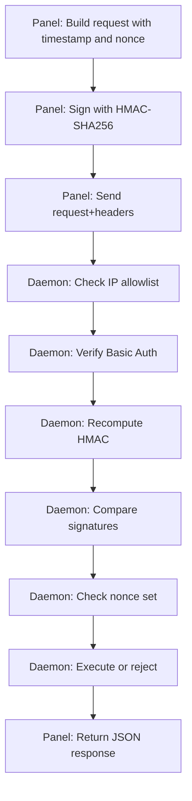

Most game panels use a shared secret or API key and call it a day. AirLink uses HMAC-SHA256 with timestamps, nonces, and IP allowlisting. Here is why.

## The problem with shared secrets

A shared secret is a password. If someone captures it, they own the daemon. There is no way to know if the request is fresh, if it has been replayed, or if it came from the panel at all.

For a game panel that manages Docker containers, that is a problem. A replayed "delete container" request is a very real attack vector.

## How HMAC works

HMAC stands for Hash-based Message Authentication Code. It combines a secret key with a message to produce a signature. The receiver recomputes the signature with the same key and compares.

## The four layers

Every panel-to-daemon request goes through four checks:

**4** auth layers

**1. IP allowlist** — the daemon only accepts requests from known panel IPs. If your IP is not on the list, the connection is dropped before anything else happens.

**2. Basic Auth** — the daemon key is sent as a basic auth credential. This is the "something you have" factor.

**3. HMAC-SHA256** — the signature covers the HTTP method, path, timestamp, nonce, and body. This proves the request was signed by someone who knows the daemon key and has not been tampered with.

**4. Nonce set** — each nonce can only be used once. The daemon keeps a set of recent nonces and rejects duplicates. This prevents replay attacks.

## Timestamps

The panel includes an ISO timestamp with every request. The daemon rejects requests older than a configurable window (default: 30 seconds). This limits the window for replay attacks.

Even if someone captures a valid signed request, they have 30 seconds to replay it before the timestamp expires. The nonce set makes replay within that window impossible too.

## Why not just use HTTPS?

HTTPS encrypts the transport. It does not authenticate the sender. Without HMAC, any process that can reach the daemon port can send commands. The IP allowlist helps, but IPs can be spoofed behind certain proxy configurations.

HMAC ensures that only the panel — the entity that knows the daemon key — can sign valid requests. Even if the transport is intercepted, the signature cannot be forged without the key.

## The nonce set

The daemon maintains a set of recently used nonces. When a request arrives:

1. Extract the nonce from the headers
2. Check if it is in the set
3. If yes, reject (replay detected)
4. If no, add it to the set and process the request

The set is bounded. Old nonces are evicted to prevent memory growth. The window is large enough to catch replays but small enough to not cause issues with clock skew.

## In practice

The result is a panel-daemon link that is resistant to:

- Replay attacks (nonce + timestamp)
- Request tampering (HMAC signature)
- Unauthorized access (IP allowlist + Basic Auth + HMAC)
- Man-in-the-middle (HTTPS + HMAC)

It is more complex than a shared API key, but it is the kind of complexity that keeps your game servers from getting deleted by a replayed HTTP request.
