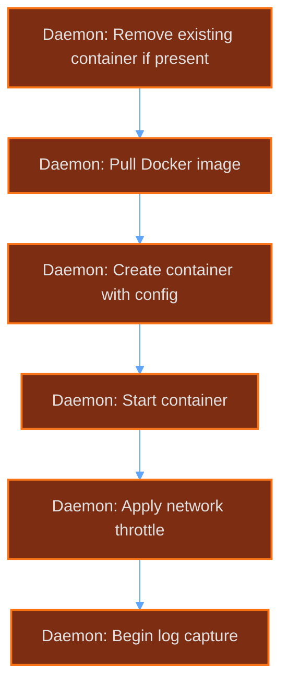

# Container Management

The AirLink container management system provides a unified interface for deploying, configuring, and monitoring game server containers across multiple runtimes.

## Runtime Support

AirLink supports two container runtimes with automatic detection:

| Runtime | Module          | Socket Path (default)     | Notes               |
| ------- | --------------- | ------------------------- | ------------------- |
| Docker  | `dockerode`     | `/var/run/docker.sock`    | Primary runtime     |
| Podman  | `podmanRuntime` | `/run/podman/podman.sock` | Rootless compatible |

**Auto-detection:** On startup, the daemon checks each socket path in order. If Docker is available, it is preferred. Podman is used as fallback. Override with `AIRLINK_CONTAINER_RUNTIME=docker` or `airlink`.

The runtime abstraction layer presents a common API regardless of backend. All calls (create, start, stop, inspect, logs) go through this layer.

## Container Lifecycle

### States

```
missing -> installing -> created -> starting -> running -> stopping -> stopped
                                    \-> crashed -> restarting
```

### Operations

| Operation | Action                                         | Timeout   | Notes               |
| --------- | ---------------------------------------------- | --------- | ------------------- |
| Install   | Pull image or run installer script             | Varies    | See Install System  |
| Start     | Create, start, apply config, begin log capture | 30s       | Cached config saved |
| Stop      | Graceful shutdown sequence                     | 30s total | See below           |
| Restart   | Stop then start                                | 40s       | Uses cached config  |
| Kill      | Force remove container                         | 5s        | No cleanup          |
| Delete    | Remove container + volume                      | 10s       | Destroys data       |

### Stop Sequence

1. Send `stopCmd` if configured (default: `stop`)
2. Poll container state every second for up to 10s
3. If still running, call Docker/Podman stop with 20s grace period
4. If still running after grace period, force kill with 5s timeout
5. Return final state

### Start Sequence



1. Remove existing container if present (name collision)
2. Create container with configuration (see Container Configuration)
3. Start container
4. Apply network throttle if configured (tc qdisc)
5. Begin log capture (stdout/stderr streaming)
6. Start storage poller (30s interval)
7. Save config to `storage/containerConfigs/<id>.json`

### Restart Sequence

1. Load cached config from `storage/containerConfigs/<id>.json`
2. Stop container (full stop sequence)
3. Start with cached config
4. Log restart event

## Container Configuration

### Security Hardening

Every container is created with these restrictions by default:

| Setting             | Value  | Reason                       |
| ------------------- | ------ | ---------------------------- |
| `ReadonlyRootfs`    | `true` | Prevent filesystem tampering |
| `no-new-privileges` | `true` | Block privilege escalation   |
| `CapDrop`           | `ALL`  | Remove Linux capabilities    |
| `PidsLimit`         | `256`  | Prevent fork bombs           |
| `BlkioWeight`       | `500`  | Fair I/O scheduling          |

Additional capabilities (e.g., `NET_ADMIN`) are added back only when explicitly required by the server configuration.

### Memory Allocation

Memory overhead is calculated based on available system RAM to prevent host OOM:

| System RAM | Overhead % | Effective Limit |
| ---------- | ---------- | --------------- |
| <= 2 GB    | 15%        | 300 MB max      |
| <= 4 GB    | 10%        | 400 MB max      |
| > 4 GB     | 5%         | No cap          |

The container receives `Total RAM - Overhead` as its memory limit. Java heap and other runtimes must fit within this allocation.

### Networking

- **DNS:** Hardcoded to `1.1.1.1` and `1.0.0.1` (Cloudflare)
- **Restart policy:** `unless-stopped` (survives host reboot)
- **Network throttle:** Applied via `tc qdisc` if bandwidth limits are configured in server settings

### Storage Enforcement

The daemon polls container disk usage every 30 seconds. If usage exceeds the configured limit, a warning is logged and (if configured) actions are taken:

- Log warning at 80% capacity
- Alert at 90% capacity
- Block writes at 100% (if enforcement enabled)

### Mount Validation

Certain host paths are forbidden to prevent container escapes and host damage:

| Forbidden Path | Reason                   |
| -------------- | ------------------------ |
| `/proc`        | Host process information |
| `/sys`         | Host kernel parameters   |
| `/dev`         | Host device nodes        |
| `/run`         | Host runtime state       |

Any mount targeting these paths is rejected at container creation with an error.

## Init Script

Every container receives an init script injected before the user's entrypoint. This script runs as PID 1 inside the container.

### Responsibilities

1. **Hostname:** Sets container hostname to `airlinkd`
2. **Console FIFO:** Creates a named pipe at `/home/container/.airlinkd/console.in`
3. **Entrypoint piping:** Reads from the FIFO and writes to the original entrypoint's stdin

This allows AirLink to send console commands to the server process without modifying the server image. The FIFO acts as a relay between the daemon's console API and the server's stdin.

```
Daemon -> FIFO -> init script -> server stdin
                                 server stdout -> log stream -> Daemon
```

## Config File Application

AirLink uses a Wings/PTDL-v2 compatible configuration system for applying settings to container files.

### Supported Parsers

| Format     | Extensions      | Notes                    |
| ---------- | --------------- | ------------------------ |
| Properties | `.properties`   | Java-style key=value     |
| YAML       | `.yaml`, `.yml` | Full YAML spec           |
| JSON       | `.json`         | Standard JSON            |
| INI        | `.ini`          | Section-based config     |
| XML        | `.xml`          | XPath-style selectors    |
| Plain      | Everything else | Line-by-line replacement |

The parser is auto-detected from file extension. Manual override available in server config.

### Token Resolution

Configuration values support template tokens that are resolved at apply time:

| Token                           | Resolves To                | Example                 |
| ------------------------------- | -------------------------- | ----------------------- |
| `{{server.build.default.port}}` | Server's configured port   | `25565`                 |
| `{{env.VAR_NAME}}`              | Environment variable value | `{{env.SERVER_MEMORY}}` |

### IfValue

Conditional logic for config values:

```
{{ifValue value1}}true_block{{else}}false_block{{end}}
```

If the current config value equals `value1`, the true block is used. Otherwise, the false block applies. This allows environment-specific configuration without separate files.

## Crash Detection and Auto-Restart

### Detection Method

The daemon subscribes to Docker/Podman event streams and listens for `die` events with non-zero exit codes. This provides real-time crash detection without polling.

### Auto-Restart Flow

1. `die` event received with non-zero exit code
2. Log crash with exit code and timestamp
3. Wait 5 seconds (backoff delay)
4. Load cached config from `storage/containerConfigs/<id>.json`
5. Execute start sequence with cached config
6. Log restart attempt

The 5-second delay prevents rapid restart loops during persistent failures. The cached config ensures the container restarts with its original settings even if the daemon restarted.

### Cache Location

```
storage/containerConfigs/<container_id>.json
```

Updated on every successful start. Deleted on container removal.

## Install System

AirLink supports two installation methods for server containers.

### Installer Container

Used when the server image includes an AirLink installer layer:

1. Pull the base image
2. Create a temporary container with entrypoint `["/bin/sh", "-c", "<install_script>"]`
3. Mount the install script into the container
4. Stream install output to `install_logs.json`
5. Commit the container as the final image on success

This approach keeps install logic inside the container and supports complex setup (compiling mods, downloading dependencies, etc.).

### Script-Based Install

For servers without an installer layer:

1. Download install scripts from AirLink's script cache or server-specific URLs
2. Execute scripts in sequence within a temporary container
3. Cache downloaded scripts locally (ALC cache) for faster subsequent installs
4. Log all output for debugging

### Operation Manager

Install operations are rate-limited to prevent resource exhaustion:

| Setting                 | Value       |
| ----------------------- | ----------- |
| Max concurrent installs | 4           |
| Queue behavior          | FIFO        |
| Timeout per install     | 300 seconds |

If all slots are occupied, new installs enter a queue and execute when a slot opens.

### State Persistence

Install state is persisted to survive daemon restarts:

```
storage/install_logs.json
```

This file tracks:

- Active installs (in progress)
- Recent install history (success/failure)
- Timestamps and duration
- Output logs (last 1000 lines per install)

On daemon startup, any interrupted installs are marked as failed and cleaned up.
