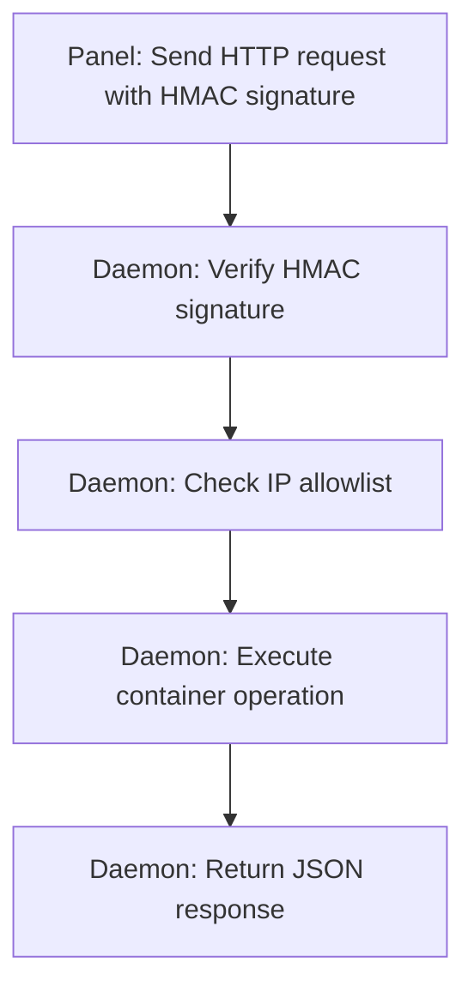

# Daemon Overview

The AirLink daemon (`airlinkd`) is the node-side agent that manages game server containers. It runs on each machine that hosts servers, listens for HTTP requests from the panel, and executes container operations locally via the Docker API.

The daemon is a standalone Node.js application. It does not depend on the panel codebase and can be installed independently on any machine running Docker.

## Architecture



The daemon communicates with the panel over HTTP using HMAC-SHA256 signed requests. Each request is authenticated, rate-limited, and validated before execution.

The panel is the central hub. Daemons are the spokes. Each daemon maintains its own local state and exposes an HTTP API that the panel calls to perform container operations. There is no persistent connection between the panel and daemons; every interaction is a standalone HTTP request authenticated via HMAC-SHA256.

### Core Components

| Component            | Role                                                     |
| -------------------- | -------------------------------------------------------- |
| HTTP server          | Accepts panel API requests and serves WebSocket streams  |
| Docker runtime layer | Wraps the Docker Engine API for container lifecycle mgmt |
| File system manager  | Reads/writes server files within volume roots            |
| Backup engine        | Creates and restores zip archives of server directories  |
| SFTP session manager | Spins up isolated `atmoz/sftp` containers on demand      |
| WebSocket hub        | Streams console output, container status, and node stats |

## CLI

The daemon is managed through its binary. Commands:

| Command              | Description                                          |
| -------------------- | ---------------------------------------------------- |
| `airlinkd start`     | Start the daemon in the foreground                   |
| `airlinkd status`    | Print current daemon status and connection state     |
| `airlinkd version`   | Print version string                                 |
| `airlinkd configure` | Interactively set node ID, address, port, and key    |
| `airlinkd health`    | Run health checks (Docker, disk, memory, panel conn) |
| `airlinkd validate`  | Validate the current configuration file              |
| `airlinkd logs`      | Tail recent daemon logs from stdout or log file      |

### Examples

```bash
airlinkd start
airlinkd start --port 3002
airlinkd status
airlinkd version
airlinkd health
airlinkd validate
airlinkd logs --tail 100
```

## Configuration

All configuration lives in a single `.env` file at the daemon root. Values are validated at startup using Zod schemas. Invalid configuration causes the daemon to exit immediately with a descriptive error.

### Environment Variables

| Variable          | Required | Default     | Description                                              |
| ----------------- | -------- | ----------- | -------------------------------------------------------- |
| `NODE_ID`         | Yes      |             | Unique node identifier (assigned by panel)               |
| `NODE_SECRET`     | Yes      |             | Shared secret for HMAC authentication                    |
| `PORT`            | No       | `3002`      | HTTP listen port                                         |
| `SFTP_PORT`       | No       | `3003`      | SFTP proxy listen port                                   |
| `PANEL_URL`       | Yes      |             | Full URL of the panel (e.g. `https://panel.example.com`) |
| `DEBUG`           | No       | `false`     | Enable verbose debug logging                             |
| `STATS_INTERVAL`  | No       | `10000`     | Node stats reporting interval in milliseconds            |
| `ALLOWED_IPS`     | No       | `*`         | Comma-separated IP allowlist for incoming requests       |
| `BACKUP_PATH`     | No       | `./backups` | Directory for backup archives                            |
| `SERVER_PATH`     | No       | `./servers` | Root directory for server volumes                        |
| `LOG_PATH`        | No       | `./logs`    | Directory for daemon log files                           |
| `MAX_UPLOAD_SIZE` | No       | `104857600` | Maximum upload size in bytes (default 100 MB)            |
| `MAX_CONNECTIONS` | No       | `200`       | Maximum concurrent WebSocket connections                 |

### Zod Validation

On startup, the daemon validates every environment variable against its Zod schema. Required variables must be present. Type coercion is applied to numeric values. If validation fails, the daemon logs the first error and exits with code 1.

```
Error: Invalid configuration
  - NODE_SECRET: Required
  - PORT: Expected number, received "abc"
```

## Directory Structure

The daemon creates and manages the following directories at runtime:

```
/etc/daemon/                    # Daemon installation root
  .env                          # Configuration file
  dist/                         # Compiled application
  node_modules/                 # Dependencies
  data/                         # Runtime data root
    servers/                    # Server volume mounts
      {server-uuid}/            # Per-server directory
        container/              # Container filesystem overlay
        backups/                # Per-server backup storage
    backups/                    # Global backup archive storage
    logs/                       # Daemon log files
    tmp/                        # Temporary files (builds, extractions)
```

### Volume Layout

Each server gets a directory under `data/servers/{uuid}/`. The daemon mounts this into the container at the path specified by the image definition. Backups are zip archives stored in `data/backups/` or per-server subdirectories.

## Bootstrap Sequence

When the daemon starts, it runs through these steps in order:

1. **Parse configuration** -- Load `.env`, validate with Zod, apply defaults
2. **Check Docker** -- Verify Docker daemon is reachable via the socket
3. **Resolve panels** -- Attempt to reach the panel at `PANEL_URL`
4. **Register node** -- POST to `/api/v2/nodes` with the node ID and stats
5. **Start HTTP server** -- Bind to `PORT` and begin accepting requests
6. **Start WebSocket server** -- Attach to the same HTTP server
7. **Start stats reporter** -- Begin periodic stats collection and reporting
8. **Log ready state** -- Print version and listen address to stdout

If any step fails (Docker unreachable, panel unreachable, bind failure), the daemon logs the error and exits.

## Dependencies

| Package            | Purpose                                           |
| ------------------ | ------------------------------------------------- |
| `dockerode`        | Docker Engine API client for container operations |
| `ssh2`             | SSH server for SFTP session management            |
| `archiver`         | Zip archive creation for backups                  |
| `zod`              | Configuration and input validation                |
| `minecraft-status` | Minecraft server query protocol support           |
| `express`          | HTTP server framework                             |
| `ws`               | WebSocket server                                  |

### Native Modules

The daemon includes native modules in a `libs/` directory that are compiled separately during installation. These handle low-level operations like path resolution for the security layer and system information gathering.

```bash
cd libs
npm install
npm rebuild
```

## Communication Protocol

The daemon exposes two interfaces to the panel:

### HTTP API

All REST-style operations go through the HTTP API. Authentication uses HMAC-SHA256 signatures with timestamps, nonces, and IP allowlisting. See [daemon/security.md](security.md) for the full protocol specification.

Key endpoints:

| Method   | Path                      | Purpose               |
| -------- | ------------------------- | --------------------- |
| `GET`    | `/health`                 | Health check          |
| `GET`    | `/version`                | Return daemon version |
| `POST`   | `/servers/:uuid/start`    | Start a container     |
| `POST`   | `/servers/:uuid/stop`     | Stop a container      |
| `POST`   | `/servers/:uuid/restart`  | Restart a container   |
| `DELETE` | `/servers/:uuid`          | Destroy a container   |
| `GET`    | `/servers/:uuid/files/**` | Read files            |
| `POST`   | `/servers/:uuid/files/**` | Write/upload files    |
| `DELETE` | `/servers/:uuid/files/**` | Delete files          |
| `POST`   | `/servers/:uuid/backup`   | Create backup         |
| `GET`    | `/stats`                  | Node resource stats   |

### WebSocket

Real-time streams for console, container status, and node stats. Connections are authenticated with capability tokens (JWT signed by the daemon secret). See [daemon/websocket.md](websocket.md) for the full protocol specification.

| Endpoint               | Purpose                            |
| ---------------------- | ---------------------------------- |
| `/container/:id`       | Interactive console (stdin/stdout) |
| `/containerstatus/:id` | Container state and resource stats |
| `/containerevents/:id` | Container lifecycle events         |
| `/nodestats`           | Host-level resource statistics     |

## Systemd Service

The installer creates a systemd unit for the daemon:

```ini
[Unit]
Description=AirLink Daemon
After=network.target docker.service
Requires=docker.service

[Service]
Type=simple
User=root
WorkingDirectory=/etc/daemon
ExecStart=/usr/bin/node dist/app/app.js
Restart=on-failure
RestartSec=5

[Install]
WantedBy=multi-user.target
```

The daemon requires Docker to be running before it starts. It restarts automatically on failure with a 5-second delay.

### Managing the Service

```bash
systemctl status airlink-daemon
systemctl restart airlink-daemon
journalctl -u airlink-daemon -f
```

## Resource Stats

The daemon collects and reports host-level resource usage on a configurable interval (`STATS_INTERVAL`). Stats include:

- CPU usage percentage
- Memory usage (used vs total)
- Disk usage (used vs total)
- Network I/O (bytes in/out)

These are available via the `/stats` HTTP endpoint and the `/nodestats` WebSocket stream. The panel polls `/stats` periodically to update node health in the dashboard.

## Backup System

Backups are zip archives of a server's volume directory. The daemon creates them locally and the panel can download or restore from them.

| Property          | Value                         |
| ----------------- | ----------------------------- |
| Format            | Zip                           |
| Storage location  | `data/backups/` or per-server |
| Max concurrent    | 1 per server                  |
| Progress tracking | Via polling endpoint          |

The panel can also trigger backups from scheduled jobs. Backups are created in a temporary directory, compressed, and moved to the final location atomically.

## SFTP

SFTP access is on-demand. When a user connects, the daemon spins up an isolated `atmoz/sftp` container with a short-lived port and temporary credentials. The container is destroyed when the session ends.

This means no permanent SFTP server is running and no extra ports are left open between sessions.
