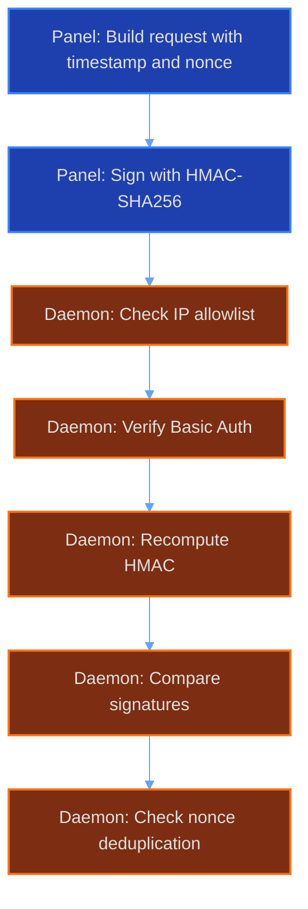

# Daemon Security

This document describes the security mechanisms built into the AirLink daemon HTTP server.

## HMAC Authentication

The daemon authenticates incoming requests using HMAC-SHA256 signatures. This is the primary auth method for internal API calls.



### Protocol

Version: v1 (current)

### Signing Format

```
HMAC-SHA256(key, "${ts}:${nonce}:${METHOD}:${path}:${bodyRepr}")
```

| Field      | Description                             |
| ---------- | --------------------------------------- |
| `key`      | Daemon shared secret                    |
| `ts`       | Unix timestamp (seconds)                |
| `nonce`    | Random string, unique per request       |
| `METHOD`   | HTTP method (uppercase)                 |
| `path`     | Request path (no query string)          |
| `bodyRepr` | `digest:sha256_hex` of the request body |

### Time Window

Requests older than 30 seconds are rejected. Server and client clocks must be reasonably synced.

### Required Headers

| Header                      | Value                                                         |
| --------------------------- | ------------------------------------------------------------- |
| `x-airlink-timestamp`       | Unix timestamp used in signing                                |
| `x-airlink-signature`       | Hex-encoded HMAC-SHA256 output                                |
| `x-airlink-nonce`           | Nonce used in signing                                         |
| `x-airlink-payload-version` | Protocol version (`1`)                                        |
| `x-airlink-digest`          | `sha256_hex` of the body (must match `bodyRepr` in signature) |

### Body Handling

The body hash is computed while streaming the request body. The server does not buffer the entire body into memory before hashing. This means large uploads still get authenticated without excessive memory use.

## Basic Auth

A simpler fallback for cases where HMAC is overkill.

### Format

```
Authorization: Basic Airlink:<daemon_key>
```

The username is always `Airlink`. The password is the daemon key.

### Comparison

Credentials are compared using constant-time string comparison to prevent timing attacks.

## IP Allowlist

Restrict which client IPs can reach the daemon.

### Configuration

Set the `ALLOWED_IPS` environment variable to a comma-separated list of allowed IPs or CIDR ranges.

### Scope

Applied to both HTTP and WebSocket connections. Requests from IPs not in the list are dropped before any other auth check runs.

## Rate Limiting

Two separate rate limiters protect the daemon.

| Limit                 | Window   | Action       |
| --------------------- | -------- | ------------ |
| 300 requests          | 1 minute | 429 response |
| 60 WebSocket upgrades | 1 minute | 429 response |

Both limits are per-IP. The 429 response includes a `Retry-After` header telling the client when to retry.

## Path Jailing

Ensures file operations stay within the intended volume root. Prevents directory traversal.

### Validation Steps

1. Resolve the target path against the volume root
2. Walk symlink chains manually, up to depth 10
3. Reject any path containing null bytes
4. On Linux, use `openat2` FFI with `RESOLVE_BENEATH` and `RESOLVE_NO_SYMLINKS` for an extra layer of protection

### Reject Criteria

- Path escapes volume root after resolution
- Symlink chain exceeds depth 10
- Path contains `\0` (null byte)
- `openat2` returns `EACCES` or `EINVAL`

## SSRF Protection

Prevents the daemon from making requests to internal network addresses.

### IP Classification

The following ranges are blocked as destinations:

| Class      | Ranges                                          |
| ---------- | ----------------------------------------------- |
| Loopback   | `127.0.0.0/8`, `::1/128`                        |
| Link-local | `169.254.0.0/16`, `fe80::/10`                   |
| Private    | `10.0.0.0/8`, `172.16.0.0/12`, `192.168.0.0/16` |
| CGNAT      | `100.64.0.0/10`                                 |
| ULA        | `fc00::/7`                                      |
| Multicast  | `224.0.0.0/4`, `ff00::/8`                       |

### DNS Resolution

Before connecting, the daemon resolves the hostname and checks the resulting IPs against the blocked ranges. A DNS response that resolves to a blocked IP is rejected even if the original hostname looked innocent.

### Redirects

HTTP redirects are followed up to 5 hops. Beyond that, the request is aborted. Each hop is re-checked against the IP classification rules.

## Download Tokens

One-time tokens for secure file downloads.

### Properties

| Property   | Value             |
| ---------- | ----------------- |
| Entropy    | 256 bits (CSPRNG) |
| TTL        | 90 seconds        |
| Usage      | Single-use        |
| Max active | 10,000            |

Once a token is consumed or expires, it is deleted. The server tracks active tokens and returns 429 if the limit is hit.

## WebSocket Auth

WebSocket connections use a separate auth flow.

### Capability Tokens

Clients send a JWT-like capability token on connection. The token contains the permitted actions and an expiry.

### Timeouts

| Constraint        | Value                    |
| ----------------- | ------------------------ |
| Auth window       | 10 seconds after connect |
| Max auth attempts | 5 per connection         |

If the client does not authenticate within 10 seconds, or fails 5 times, the connection is closed.

## Body Size Limits

| Upload Type     | Limit  |
| --------------- | ------ |
| Backup upload   | 50 GB  |
| Everything else | 100 MB |

Requests exceeding these limits receive a 413 response. The limits are enforced at the HTTP parser level before the body is fully read.
