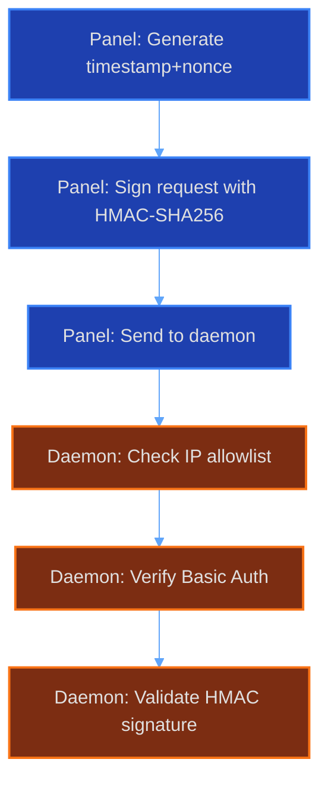

v2.0.0-rc1 is the first public release candidate for AirLink Panel 2.0. This one changes how the panel talks to daemons, adds Pterodactyl eggs to the image store, ships addon migrations, and makes SFTP sessions on-demand.

## HMAC replaces WebSocket auth

The daemon protocol got a rewrite. Panel-to-daemon communication now uses HMAC-signed HTTP requests instead of the older WebSocket flow.



Every request includes a timestamp, a random nonce, and an HMAC-SHA256 signature. The daemon checks the IP allowlist, verifies Basic Auth, validates the HMAC, and rejects replays via the nonce set.

No shared sessions. No cookies. No weird connection-state bugs at 3am.

**6** auth checks per request

## Pterodactyl eggs in the store

The image store now includes the official Pterodactyl eggs. Minecraft, Rust, CS2, Terraria, ARK, and a lot more are available when creating a server, with no manual setup.

Go to **Admin > Images > Store**, pick an egg, click install.

## Addon migrations

Addons can now define database migrations in their `package.json`. Each migration has a unique name and a SQL string. They run in order when the addon is first enabled and are tracked so they never run twice.

```json
{
  "migrations": [
    {
      "name": "my_addon_v1_create_items",
      "sql": "CREATE TABLE IF NOT EXISTS MyAddonItems (id INTEGER PRIMARY KEY AUTOINCREMENT, name TEXT NOT NULL)"
    }
  ]
}
```

Works across SQLite, MySQL, and PostgreSQL. See [Database Migrations](/docs/database-migrations/) for the full reference.

## On-demand SFTP

SFTP sessions are now created only when needed. The daemon spins up an isolated `atmoz/sftp` container per session with a short-lived port and credentials, then cleans it up when you disconnect.

No permanent SFTP server running. No ports left open.

## What's next

This is still a release candidate. Expect rough edges. Report problems on [GitHub](https://github.com/airlinklabs/panel/issues) and they will get cleaned up before the stable release.
